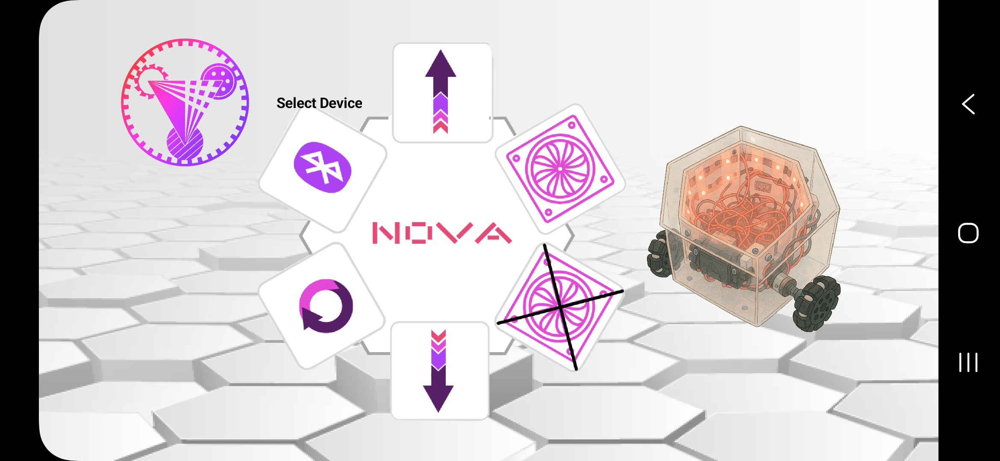
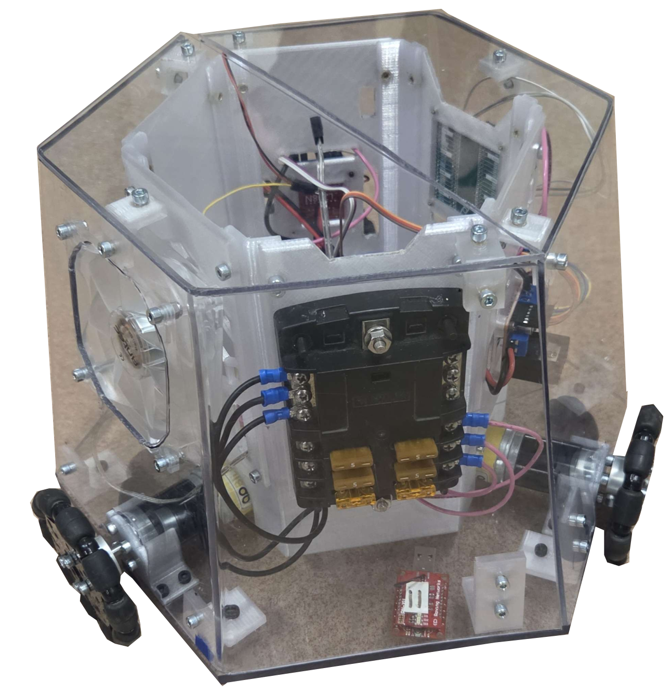

# Nova 
**Nova IIT Robotics**

This repository contains the Nova project developed by the IIT Robotics Club. It integrates a Bluetooth-based robot controller system with a mobile application built using MIT App Inventor and firmware powered by PlatformIO.
Inspo: Osiris IIT Robotics Hexagon Robot

---

## Mobile App Setup

**MIT App Inventor Project Import Instructions**

You can import and modify the mobile app via MIT App Inventor:
 [MIT App Inventor 2](https://ai2.appinventor.mit.edu/)

### Steps:
1. Download `NovaBT_App.aia` from the `NovaBT_App/` folder.
2. Go to MIT App Inventor and click **Projects > Import project (.aia) from my computer**.
3. Select the `NovaBT_App.aia` file to upload and start editing or building the app.

---

## Circuit Design

The full schematic and component layout is available at:

[Cirkit Designer Project](https://app.cirkitdesigner.com/project/37879cb2-f932-4b11-823c-6e093d93b950)

---

## Folder Structure

```
Nova/
├── ClientCode/             # Python-based controller code
│   └── Controller.py
│
├── NovaBT_App/             # Mobile App Inventor project
│   ├── NovaBT_App.aia
│   ├── NovaBT_App.apk
│   ├── NovaBT_App.aab
│   └── README              # App import instructions
│
├── NovaProject/            # PlatformIO firmware project
│   ├── .vscode/
│   ├── include/
│   ├── lib/
│   ├── src/
│   ├── test/
│   ├── .gitignore
│   └── platformio.ini
│
├── README.md               # This file
└── .DS_Store               # macOS system file (can be ignored)

```

---

## Tools & Technologies
- **MIT App Inventor** for Android app development  
- **Python** for desktop-based controller interface  
- **PlatformIO + C++** for microcontroller firmware  
- **Cirkit Designer** for hardware design


---

<h2>📸 Nova Robot Gallery</h2>

<p><strong>GUI Interface</strong></p>


<p><strong>Nova Lights Off - View 1</strong></p>


<p><strong>Qing Dynasty Dragon Color Style</strong></p>

