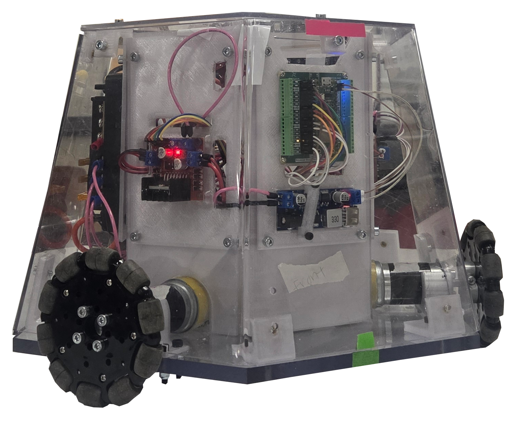
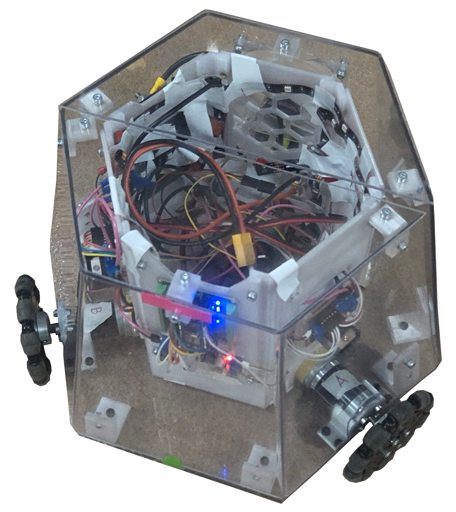

# Nova  
**Nova IIT Robotics**

This repository contains the Nova project developed by the IIT Robotics Club. It integrates a Bluetooth‑based robot controller system with a mobile application built using MIT App Inventor and firmware powered by PlatformIO.  
_Inspo: Osiris IIT Robotics Hexagon Robot_

---

## Mobile App Setup

**MIT App Inventor Project Import Instructions**

You can import and modify the mobile app via MIT App Inventor:  
[MIT App Inventor 2](https://ai2.appinventor.mit.edu/)

### Steps:
1. Download `NovaBT_App.aia` from the `NovaBT_App/` folder.  
2. Go to MIT App Inventor and click **Projects > Import project (.aia) from my computer**.  
3. Select the `NovaBT_App.aia` file to upload and start editing or building the app.

---

## Circuit Design

The full schematic and component layout is available at:  
[Cirkit Designer Project](https://app.cirkitdesigner.com/project/37879cb2-f932-4b11-823c-6e093d93b950)

---

## Folder Structure

```plaintext
Nova/
├── ClientCode/             # Python-based controller code
│   └── Controller.py
│
├── NovaProject/            # PlatformIO firmware project
│   ├── .vscode/
│   ├── include/
│   ├── lib/
│   ├── src/
│   ├── test/
│   ├── .gitignore
│   └── platformio.ini
│
├── Nova_App/             # Mobile App Inventor project
│   ├── NovaBT_App.aia
│   ├── NovaBT_App.apk
│   ├── NovaBT_App.aab
│   └── README              # App import instructions
│
├── Photobooth/             # Photos
├── README.md               # This file
└── .DS_Store               # macOS system file
```


<p><strong>Colorful Nova</strong></p>

<table>
  <tr>
    <td align="center">
      <br>
      **Dead Sea**
    </td>
    <td align="center">
      <br>
      **Strong Blue**
    </td>
    <td align="center">
      <br>
      **Cool Crayon**
    </td>
  </tr>
  <tr>
    <td align="center">
      <br>
      **Star of David**
    </td>
    <td align="center">
      <br>
      **Rose Yogurt**
    </td>
    <td align="center">
      <br>
      **Burning Ultrablue**
    </td>
  </tr>
  <tr>
    <td align="center">
      <br>
      **Red Radish**
    </td>
    <td align="center">
      <br>
      **Seljuk Blue**
    </td>
    <td align="center">
      <br>
      **Qing Dynasty Dragon**
    </td>
  </tr>
  <tr>
    <td align="center">
      <br>
      **Cerulean**
    </td>
    <td align="center">
      <br>
      **LightsOff Nova 2**
    </td>
    <td align="center">
      <br>
      **LightsOff Nova 3**
    </td>
  </tr>
</table>
